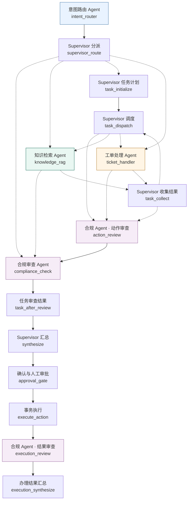

# Agent 编排

四个模型角色通过 Supervisor 与确定性的业务控制节点协作。模型审查结果不能替代服务端鉴权、确认、人工审批与事务校验。

```mermaid
flowchart TD
    task_initialize["Supervisor 任务计划<br/>task_initialize"]
    task_dispatch["Supervisor 调度<br/>task_dispatch"]
    task_collect["Supervisor 收集结果<br/>task_collect"]
    task_after_review["任务审查结果<br/>task_after_review"]
    intent_router["意图路由 Agent<br/>intent_router"]
    supervisor_route["Supervisor 分派<br/>supervisor_route"]
    knowledge_rag["知识检索 Agent<br/>knowledge_rag"]
    ticket_handler["工单处理 Agent<br/>ticket_handler"]
    action_review["合规 Agent · 动作审查<br/>action_review"]
    compliance_check["合规审查 Agent<br/>compliance_check"]
    synthesize["Supervisor 汇总<br/>synthesize"]
    approval_gate["确认与人工审批<br/>approval_gate"]
    execute_action["事务执行<br/>execute_action"]
    execution_review["合规 Agent · 结果审查<br/>execution_review"]
    execution_synthesize["办理结果汇总<br/>execution_synthesize"]
    action_review --> compliance_check
    approval_gate --> execute_action
    compliance_check --> task_after_review
    execute_action --> execution_review
    execution_review --> execution_synthesize
    intent_router --> supervisor_route
    knowledge_rag -.-> compliance_check
    knowledge_rag -.-> task_collect
    supervisor_route -.-> compliance_check
    supervisor_route -.-> knowledge_rag
    supervisor_route -.-> task_initialize
    supervisor_route -.-> ticket_handler
    synthesize --> approval_gate
    task_after_review --> synthesize
    task_collect -.-> action_review
    task_collect -.-> task_dispatch
    task_dispatch -.-> action_review
    task_dispatch -.-> knowledge_rag
    task_dispatch -.-> ticket_handler
    task_initialize --> task_dispatch
    ticket_handler -.-> action_review
    ticket_handler -.-> task_collect
    classDef intent fill:#e9f3ff,stroke:#4276a9
    classDef knowledge fill:#e9f7f2,stroke:#176f5b
    classDef ticket fill:#fff5e5,stroke:#b17825
    classDef compliance fill:#f6ecf7,stroke:#98659f
    class intent_router intent
    class knowledge_rag knowledge
    class ticket_handler ticket
    class action_review,compliance_check,execution_review compliance

```
